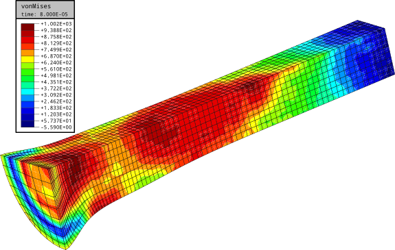

# DynELA Finite Element Code v.3.0

This repository contains the DynELA Finite Element Code v.3.0. The DynELA Finite Element Code is an Explicit FEM code written in C++ using a Python's interface for creating the Finite Element Models. This is a new version of the early proposed v.2 code written between 1996 and 2010. The previous version has been included into the CAE Linux distribution some year ago and the corresponding work has been published in some Scientific Journals (Advances in Engineering Software, Journal of Computational and Applied Mathematics;...). The aim of v.3.0 is to provide a new version of the code with enhancements concerning the constitutive laws, a new programming interface based on Python 3 formalism, along with some documentation.

## Download and installation procedure:

The DynELA FEM code is developped under Linux (an Ubuntu 20.04 LTS is currently used for the development).

### Prerequisites:

Compilation of the FEM code requires a number of libraries.

Generation of Makefiles for DynELA compilation is based on the use of the CMake application. CMake is a cross-platform, open-source build system generator. It can be installed with the following command:

	sudo apt install cmake

DynELA is written in C++ and Python 3.x therefore it needs a C++ compiler and some Python 3.x libraries. Under Ubuntu this can be installed with the following command:

	sudo apt install build-essential swig zlib1g-dev liblapacke-dev python3-dev

It also needs some Python 3.x modules to run properly and at least numpy, matplotlib:

	sudo apt install python3-numpy python3-matplotlib texlive dvipng texlive-latex-extra texlive-fonts-recommended

### Download and compilation procedure:

Download and compilation is done using the following procedure:

	git clone https://github.com/pantale/DynELA.git
	cd DynELA
	mkdir Build
	cd Build
	cmake ../Sources
	make

There is no need to install the executable or something similar to use the FEM code. Modify the .bashrc file and add the following lines where _path_to_DynELA_ points to the top directory of your DynELA installation:

	export DYNELA="path_to_DynELA"
	export PATH=$PATH:$DYNELA/bin
	export DYNELA_BIN=$DYNELA/Build/bin
	export DYNELA_LIB=$DYNELA/Build/lib
	export PYTHONPATH="$DYNELA_BIN:$PYTHONPATH"
	export PYTHONPATH="$DYNELA_LIB:$PYTHONPATH"
	export LD_LIBRARY_PATH=$DYNELA_LIB:$LD_LIBRARY_PATH

## Testing and usage:

Running one of the provided samples in Samples folder is done using the following command in one of the subdirectories:

	python sample.py

Running the tests in the Samples directories can be done through the Makefiles contained in the Samples directories. Benchmark tests can be run from any subdirectory of the Sample folder using the following command:

	make

## Postprocessing:

DynELA now has a class for direct export of contourplot results using SVG vectorial format for a 2D or 3D mesh via the Python command interface. See the documentation for all instructions concerning SVG outputs and the examples included in the Samples directories.

The DynELA FEM code can generate VTK files for the results. I'm using the Paraview postprocessor to visualize those results. Paraview is available here: https://www.paraview.org/download

***
Olivier Pantalé  
Full Professor of Mechanics  
email : olivier.pantale@enit.fr

Laboratoire Génie de Production  
Ecole Nationale d'Ingénieurs de Tarbes  
Université de Toulouse  
47 Avenue d'Azereix - BP 1629  
65016 TARBES - CEDEX - FRANCE